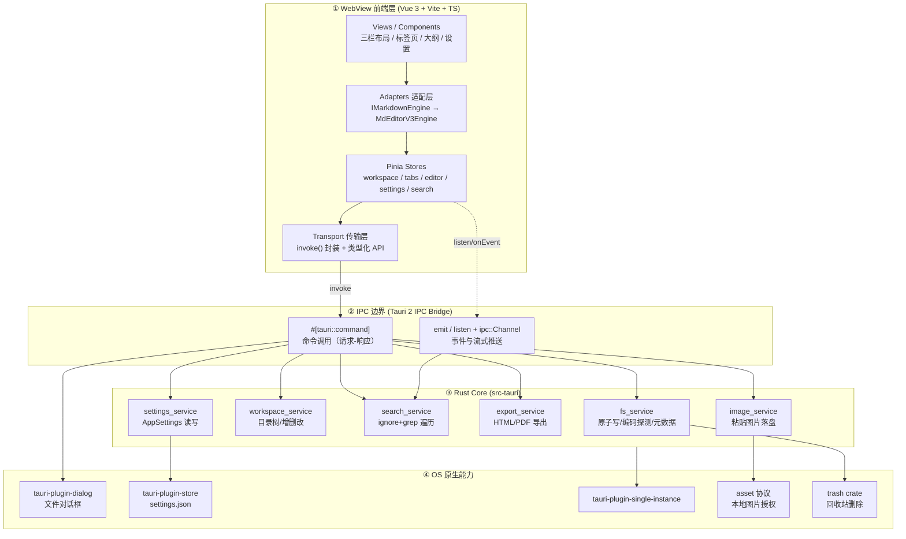
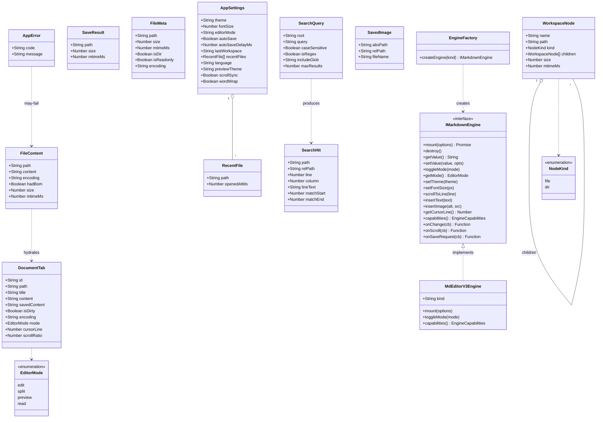
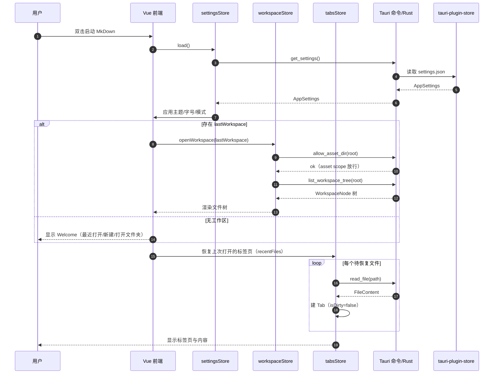
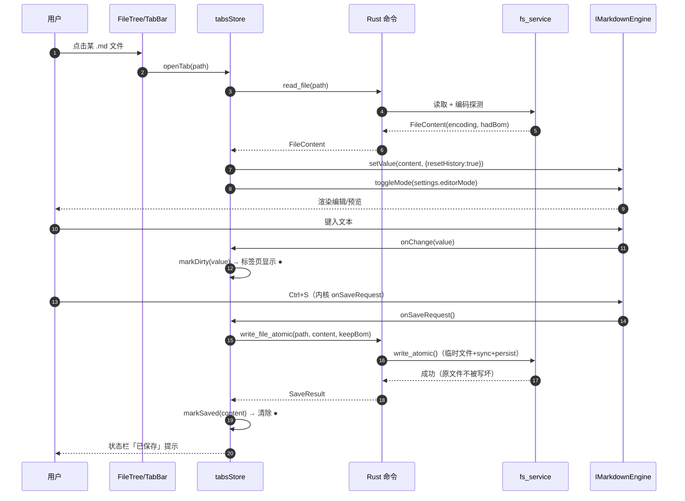
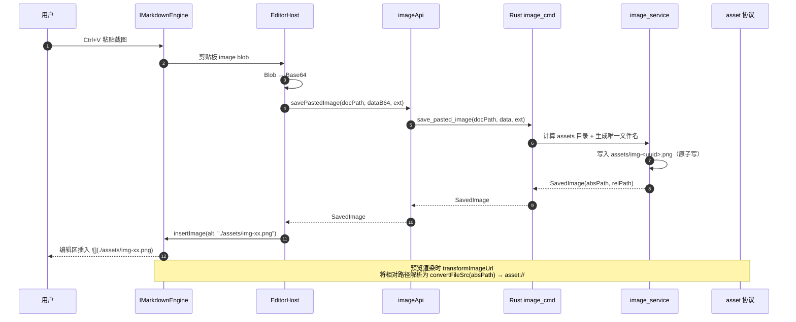
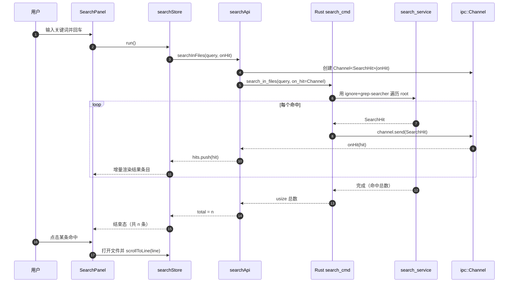
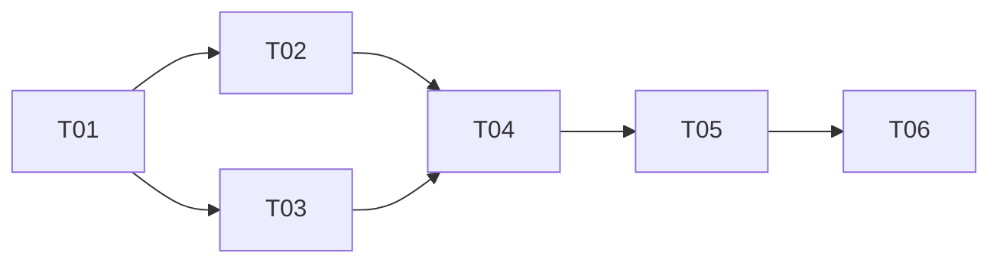

# MkDown 系统架构设计 + 任务分解

> 版本：v1.1（架构基线 · 技术栈已冻结）
> 冻结记录：**2026-09-23 飞总确认** —— 编辑内核 md-editor-v3 ｜ 外壳 Rust + Tauri 2.x ｜ 前端 **Vue 3 + Vite + TypeScript + Pinia**（不使用 React / md-editor-rt）
> 范围决策（2026-09-23 同批拍板）：① 编辑模式 = **分栏预览**（不做 WYSIWYG）｜② PDF 导出 = **WebView 打印**（预览 HTML → WebView2 打印，ADR-见 R2 落定）｜③ Mermaid / KaTeX = **维持 P1**，不进 MVP
> 作者：高见远（架构师）
> 输入：许清楚《MkDown 产品需求文档（PRD）》
> 工作目录：`D:\WWW\MkDown`
> 目标平台：Windows 优先（WebView2），macOS(WKWebView) / Linux(WebKitGTK) 次之
> 外壳硬约束：**Rust + Tauri 2.x**（非 Electron）

---

## TL;DR

MkDown 是一个**纯本地、零联网**的 Windows 桌面 Markdown「审查 + 撰写」工具，用 **Tauri 2.x（Rust Core + WebView2）** 承载 **Vue 3 + Vite + TS** 前端，编辑内核封装为 **md-editor-v3 v7.0.0**（经适配层隔离）。核心设计取舍是：**所有文件系统 / 编码 / 搜索 / 导出逻辑全部下沉到 Rust**，前端只保留 UI 状态与渲染；编辑器内核通过 `IMarkdownEngine` 接口 + `MdEditorV3Engine` 实现解耦，保证未来可无痛替换为 `md-editor-rt` 或自研；本地图片通过 Tauri **asset 协议**（`convertFileSrc`）加载而非 `file://`。

### 关键架构决策（6 条）

| # | 决策 | 一句话理由 |
|---|------|-----------|
| D1 | **文件 IO 走自写 `#[tauri::command]`，仅系统对话框/设置存储用官方插件** | 用户工作区是任意路径，`tauri-plugin-fs` 的静态 scope 无法覆盖；自写 command 内部做路径校验，比放全开 scope 更安全、更灵活。 |
| D2 | **大文件：Rust 侧一次性读取 + 前端 100ms debounce** | 300KB/1万行文本读取 <50ms，一次 IPC 成本远低于流式分片；流式只用于**搜索结果**（`ipc::Channel`）。 |
| D3 | **全文搜索：MVP 不建索引，用 `ignore` + `grep-searcher` 遍历** | 单工作区通常数百文件，遍历 1 万行级文档 ≤1s 达标；索引会引入持久化/失效复杂度，收益在 MVP 不成立。 |
| D4 | **代码高亮 / Mermaid / KaTeX 全部懒加载** | 三者是最大体积来源，按需动态 import 才能守住 ≤15MB 安装包。 |
| D5 | **预览本地图片必须走 `convertFileSrc`（asset://），禁用 `file://`** | `file://` 在 WebView2 下被 CSP 与跨域策略拦截；asset 协议可运行时动态授权当前工作区目录。 |
| D6 | **Capabilities 最小授权 + 运行时动态 scope，CSP 只放开 asset/ipc** | 不预先授权 `fs:allow-*` 全盘；用 `asset_protocol_scope().allow_directory()` 在打开工作区时按需放行。 |

---

# Part A：系统设计

## 1. 架构总览

### 1.1 分层模型（Tauri 2.x）



### 1.2 「什么逻辑放 Rust、什么放前端」判定原则

| 判定维度 | 放 Rust（Core） | 放前端（WebView） |
|---------|----------------|-------------------|
| **触碰文件系统** | ✅ 全部（读/写/移/删/遍历/探测编码） | ❌ 绝不直接碰 FS |
| **触碰系统对话框** | ✅ `tauri-plugin-dialog` | ❌ |
| **路径拼接 / 规范化** | ✅ 统一 `PathBuf`，跨平台分隔符/长路径/UNC | ❌ 只透传字符串，不拼接 |
| **编码处理** | ✅ UTF-8 / BOM / GBK 探测（`encoding_rs`） | ❌ |
| **CPU 密集 / 遍历型** | ✅ 全文搜索、目录树、正则 | ❌ |
| **纯 UI 状态** | ❌ | ✅ 标签页、展开态、选中、滚动位置 |
| **渲染 / 预览 / 高亮** | ❌ | ✅ 全部在 WebView |
| **偏好记忆** | ✅ 落 `settings.json`（store 插件） | ✅ 内存态 + debounce 回写 |
| **快捷键** | ❌（仅系统级菜单加速键声明的注册） | ✅ keymap 分发 |
| **单向派生数据** | 提供原始数据 | 做视图模型映射 |

> 一句话准则：**「凡是会失败于权限/编码/平台差异的操作，都放进 Rust 用 `Result` 表达」；「凡是像素与交互，都留在前端」。**

---

## 2. 技术选型清单

### 2.1 Rust 侧 crate

> 版本策略：Tauri 系用 `2` 主版本浮动（Cargo 会自动解析到最新 2.x）。标注「需核实」的请在 `cargo add` 时确认最新小版本。

| crate | 版本 | 用途 | 取舍理由 |
|-------|------|------|---------|
| `tauri` | `2`（features: `protocol-asset`, `devtools`） | 应用外壳 / IPC | 硬约束 |
| `tauri-plugin-dialog` | `2` | 打开/保存/消息对话框 | 官方维护，跨平台一致；避免自己调 Win32 |
| `tauri-plugin-store` | `2` | `settings.json` 持久化 KV | 免自己实现配置文件读写与并发 |
| `tauri-plugin-single-instance` | `2` | 单实例（第二次启动激活已有窗口） | 官方提供，避免手写命名互斥体 |
| `serde` | `1`（derive） | 结构体序列化 | IPC 契约基础 |
| `serde_json` | `1` | JSON 值 / store 存取 | store 插件依赖 |
| `thiserror` | `2` | 定义 `AppError` 枚举 | 派生式错误定义，零样板 |
| `anyhow` | `1` | 内部 service 层错误兜底 | 仅在 service 内部用，**命令层统一转 `AppError`** |
| `encoding_rs` | `0.8` | BOM 检测 + 编码探测/转换 | 处理 UTF-8 BOM / GBK 兼容；比 `encoding` 更活跃 |
| `encoding_rs_io` | `0.1`（需核实） | 带编码探测的 Reader | 与 `encoding_rs` 配套；若不确定可改用 `chardetng` |
| `chardetng` | `0.1`（需核实） | 无 BOM 时统计式编码猜测 | 仅当无 BOM 且非法 UTF-8 时兜底 |
| `tempfile` | `3` | 原子写（同目录临时文件 + rename） | 保证「写到一半崩溃不毁原文件」 |
| `walkdir` | `2` | 工作区目录树遍历（自实现部分） | 需要精确控制深度/排序/忽略规则 |
| `ignore` | `0.4` | 尊重 `.gitignore`/`.ignore` 的过滤遍历 | 全文搜索用，避免扫到 `node_modules` 等 |
| `grep-searcher` | `0.1`（需核实） | 高性能整行内容搜索（支持正则） | `ripgrep` 内核，比手写 `str::contains` 强 |
| `grep-regex` | `0.1`（需核实） | 正则搜索支持 | 与 `grep-searcher` 配套 |
| `trash` | `5`（需核实最新，最低 `3`） | 删除到回收站 | 跨平台回收站语义，避免误删不可恢复 |
| `regex` | `1` | 文件名/正文正则（可选） | `grep-regex` 底层 |
| `notify` | `6`（需核实） | 工作区文件外部变更监听（P1/P2 预留） | MVP 可不启用，架构预留 |
| `tokio` | `1`（features: `rt-multi-thread`,`fs`,`sync`） | 异步运行时（Tauri 已内置，仅需显式加 features） | 异步命令 + 并发搜索 |
| `chrono` | `0.4` | 时间戳（最近打开、文件元数据） | 与前端 ISO 8601 互转 |
| `uuid` | `1`（v4） | 临时文件名 / 标签页 ID | 避免并发写冲突 |
| `log` + `tauri-plugin-log`（可选） | `2` | 本地日志（**仅本地文件，禁联网**） | 便于现场排障 |

> 说明：`tauri-plugin-fs` **不加入**（见 ADR-01）。`html2pdf` 类导出见 ADR 说明（PDF 走「前端打印为 PDF / 或 WebView2 PrintToPdf」方案，不引入重型 headless 引擎）。

### 2.2 前端 npm 依赖

| 包 | 版本 | 用途 |
|----|------|------|
| `vue` | `^3.5` | 框架 |
| `vite` | `^7`（需核实） | 构建 |
| `typescript` | `^5.6` | 类型 |
| `@vitejs/plugin-vue` | 最新 | SFC 支持 |
| `pinia` | `^3`（需核实） | 状态管理 |
| `vue-router` | `^4`（可选） | 若设置页独立路由；MVP 亦可用抽屉 |
| `md-editor-v3` | `^7.0.0` | **编辑内核**（`MdEditor` / `MdPreview` / `MdCatalog`） |
| `@vavt/v3-extension` | 最新（需核实） | 语言包 / 扩展（i18n zh-CN、图标等） |
| `tdesign-icons-vue-next` 或 `@iconify/vue` | 最新 | 图标（二选一，建议 iconify 按需） |
| `prettier` | `^3` | P1：Markdown 格式化 |
| `mermaid` | `^11`（需核实） | P1：流程图（**懒加载**） |
| `katex` | `^0.16` | P1：公式（**懒加载**） |
| `highlight.js` / `shiki` | 由 md-editor-v3 内置 | 代码高亮（**懒加载主题**） |
| `vitest` + `@vue/test-utils` | 最新 | 单元测试 |
| `@tauri-apps/api` | `^2` | `invoke` / `convertFileSrc` / `event` |
| `@tauri-apps/plugin-dialog` | `^2` | 对话框 JS 绑定 |
| `@tauri-apps/plugin-store` | `^2` | 设置 JS 绑定（若走前端直接存取） |

### 2.3 插件方案：官方插件 vs 自写 command

| 需求 | 方案 | 理由 |
|------|------|------|
| 打开/保存/另存为对话框 | ✅ `tauri-plugin-dialog` | 原生体验、跨平台 |
| 设置读写 | ✅ `tauri-plugin-store` | 免造轮子，落 `$APPCONFIG/settings.json` |
| 单实例 | ✅ `tauri-plugin-single-instance` | 官方 |
| 日志（可选） | ✅ `tauri-plugin-log` | 本地文件日志 |
| 全部文件读写/遍历/搜索/导出/图片落盘 | ❌ **自写 command** | scope 无法覆盖任意工作区；需原子写、编码探测、回收站等自定义语义 |
| 本地图片显示 | ✅ **asset 协议 + 运行时动态 scope** | 官方能力，无需插件 |

---

## 3. 完整目录结构

```
D:\WWW\MkDown\
├─ docs\
│  ├─ PRD.md                     # 产品经理产出（已有/上游）
│  ├─ ARCHITECTURE.md            # 本文档
│  ├─ class-diagram.mermaid      # 类图（本档导出）
│  └─ sequence-diagram.mermaid   # 时序图（本档导出）
│
├─ src-tauri\
│  ├─ Cargo.toml                 # Rust 依赖 + release profile
│  ├─ build.rs                   # tauri-build 构建脚本
│  ├─ tauri.conf.json            # 窗口/bundle/CSP/assetProtocol 配置
│  ├─ capabilities\
│  │  └─ default.json            # 最小权限清单
│  ├─ icons\                     # 应用图标（.ico/.icns/.png）
│  └─ src\
│     ├─ main.rs                 # 进程入口，调用 lib::run()
│     ├─ lib.rs                  # Builder 装配：插件 + invoke_handler + setup
│     ├─ error.rs                # AppError 枚举 + Serialize 实现
│     ├─ state.rs                # AppState（工作区根、设置缓存、取消令牌）
│     ├─ models.rs               # IPC serde 结构体（FileContent/SearchHit/...）
│     ├─ commands\               # 命令层（薄，只做参数校验 + 调 service）
│     │  ├─ mod.rs
│     │  ├─ file_cmd.rs          # read_file/write_file_atomic/save_as/get_file_meta/open_in_system
│     │  ├─ workspace_cmd.rs     # list_workspace_tree/create_entry/rename_entry/delete_entry
│     │  ├─ search_cmd.rs        # search_in_files（Channel 流式）
│     │  ├─ image_cmd.rs         # save_pasted_image
│     │  ├─ export_cmd.rs        # export_html/export_pdf
│     │  └─ settings_cmd.rs      # get_settings/set_settings
│     └─ services\               # 业务服务层（可单测）
│        ├─ mod.rs
│        ├─ fs_service.rs        # 原子写、编码探测、元数据
│        ├─ workspace_service.rs # 目录树构建、增删改
│        ├─ search_service.rs    # ignore+grep 遍历搜索
│        ├─ image_service.rs     # 图片落盘 + 相对路径计算
│        ├─ export_service.rs    # HTML/PDF 导出
│        └─ settings_service.rs  # AppSettings 默认值/校验/读写
│
├─ src\                          # Vue 3 前端
│  ├─ main.ts                    # 应用入口：挂载 Pinia + App
│  ├─ App.vue                    # 根组件：三栏布局 + 全局弹窗
│  ├─ env.d.ts                   # Vite/TS 环境声明
│  │
│  ├─ adapters\                  # ★ 内核适配层（业务不直接依赖 md-editor-v3）
│  │  ├─ IMarkdownEngine.ts      # 引擎接口定义（唯一契约）
│  │  ├─ EngineEvents.ts         # 引擎事件类型（onChange/onScroll/...）
│  │  ├─ MdEditorV3Engine.ts     # md-editor-v3 实现类
│  │  ├─ EngineFactory.ts        # 工厂：按配置返回实现（便于切换 rt/自研）
│  │  └─ index.ts                # 对外统一导出
│  │
│  ├─ api\                       # IPC 传输层（类型化封装 invoke）
│  │  ├─ ipc.ts                  # invoke 基座 + AppError 解析
│  │  ├─ fileApi.ts              # 文件相关命令封装
│  │  ├─ workspaceApi.ts         # 工作区相关命令封装
│  │  ├─ searchApi.ts            # 搜索（含 Channel 订阅）
│  │  ├─ imageApi.ts             # 图片落盘
│  │  ├─ exportApi.ts            # 导出
│  │  ├─ settingsApi.ts          # 设置
│  │  └─ types.ts                # 与 Rust models.rs 对应的 TS 类型
│  │
│  ├─ stores\                    # Pinia
│  │  ├─ workspaceStore.ts       # 工作区树 + 当前根
│  │  ├─ tabsStore.ts            # 标签页集合 + 激活态 + 脏标记
│  │  ├─ editorStore.ts          # 当前文档内容 / 模式 / 光标 / 大纲
│  │  ├─ settingsStore.ts        # 主题/字号/自动保存/最近文件
│  │  └─ searchStore.ts          # 搜索面板状态 + 结果
│  │
│  ├─ composables\               # 组合式逻辑
│  │  ├─ useSavePipeline.ts      # 保存流水线（debounce+原子写）
│  │  ├─ useKeyboardShortcuts.ts # 快捷键体系 + F1
│  │  ├─ useScrollSync.ts        # 编辑/预览滚动同步
│  │  ├─ useOutline.ts           # 大纲提取与双向联动
│  │  ├─ useImagePaste.ts        # 粘贴图片 → 落盘 → 插相对路径
│  │  ├─ useTheme.ts             # 亮/暗主题切换
│  │  └─ useConfirmClose.ts      # 未保存关闭确认
│  │
│  ├─ components\                # 组件
│  │  ├─ layout\
│  │  │  ├─ AppShell.vue         # 三栏外壳
│  │  │  ├─ ActivityBar.vue      # 左侧图标栏
│  │  │  └─ StatusBar.vue        # 底部状态栏（字数/编码/模式）
│  │  ├─ explorer\
│  │  │  ├─ FileTree.vue         # 文件树（拖拽/右键菜单）
│  │  │  ├─ TreeNode.vue         # 递归节点
│  │  │  └─ ExplorerToolbar.vue  # 新建/刷新/折叠
│  │  ├─ editor\
│  │  │  ├─ EditorHost.vue       # 挂载引擎适配层（core 组件）
│  │  │  ├─ TabBar.vue           # 标签页栏（含 ● 脏标记）
│  │  │  ├─ OutlinePanel.vue     # 大纲/TOC
│  │  │  └─ PreviewPane.vue      # 纯阅读模式（MdPreview 经适配层）
│  │  ├─ search\
│  │  │  ├─ SearchPanel.vue      # 全局搜索面板
│  │  │  └─ SearchResultItem.vue # 结果条目（高亮命中）
│  │  ├─ settings\
│  │  │  └─ SettingsDialog.vue   # 设置弹窗（主题/字号/自动保存）
│  │  └─ common\
│  │     ├─ AppDialog.vue        # 通用对话框
│  │     ├─ EmptyState.vue       # 空态
│  │     └─ Toast.vue            # 轻提示
│  │
│  ├─ views\
│  │  ├─ Workbench.vue           # 主工作台视图
│  │  └─ Welcome.vue             # 欢迎页（最近打开/新建/打开文件夹）
│  │
│  ├─ i18n\
│  │  ├─ index.ts                # i18n 装配（zh-CN 优先）
│  │  ├─ zh-CN.ts                # 中文文案
│  │  └─ en-US.ts                # 英文兜底
│  │
│  ├─ styles\
│  │  ├─ global.css              # 全局样式 + CSS 变量（主题 token）
│  │  ├─ theme-light.css         # 亮色变量
│  │  └─ theme-dark.css          # 暗色变量
│  │
│  └─ utils\
│     ├─ path.ts                 # 前端仅做展示用的路径工具（不落盘）
│     ├─ debounce.ts             # 防抖
│     └─ markdownTemplate.ts     # 新建文件模板
│
├─ index.html
├─ package.json
├─ vite.config.ts
├─ tsconfig.json
├─ tsconfig.node.json
├─ .gitignore
└─ README.md
```

---

## 4. 编辑器内核适配层设计（★重点）

### 4.1 设计目标

- 业务代码（组件 / store / composable）**只依赖 `IMarkdownEngine`**，不 import `md-editor-v3` 的任何符号。
- 未来切换 `md-editor-rt` / 自研内核，只需新增一个实现类 + 改一行工厂配置。
- 编排型能力（模式切换、滚动同步、大文件降级）由适配层承担，业务层零感知。

### 4.2 接口定义（TS 骨架）

```ts
// src/adapters/IMarkdownEngine.ts
import type { App } from 'vue';

/** 编辑器工作模式 */
export type EngineMode = 'edit' | 'split' | 'preview' | 'read';

/** 滚动事件载荷（用于滚动同步） */
export interface ScrollPayload {
  /** 0..1 归一化进度 */
  ratio: number;
  /** 触发方：编辑区 or 预览区 */
  source: 'editor' | 'preview';
}

/** 引擎初始化参数 */
export interface EngineInitOptions {
  /** 挂载点（宿主组件提供的容器元素） */
  container: HTMLElement;
  /** 初始内容 */
  value: string;
  /** 初始模式 */
  mode: EngineMode;
  /** 主题 */
  theme: 'light' | 'dark';
  /** 字号（px） */
  fontSize: number;
  /** 是否只读（阅读态） */
  readOnly?: boolean;
  /** 图片 URL 转换器（本地图片 → asset://） */
  transformImageUrl?: (rawSrc: string) => string | Promise<string>;
  /** 大文件阈值（超过则降级：关闭实时预览） */
  largeFileThresholdBytes?: number;
}

/** 引擎能力声明（业务据此决定 UI 是否可用） */
export interface EngineCapabilities {
  supportsMermaid: boolean;
  supportsKatex: boolean;
  supportsOutline: boolean;
  supportsFormat: boolean;
  supportsScrollSync: boolean;
}

/** ★ 唯一契约：所有内核必须实现 */
export interface IMarkdownEngine {
  /** 引擎标识，用于调试/降级判断 */
  readonly kind: string;

  /** 初始化并挂载到容器 */
  mount(options: EngineInitOptions): Promise<void>;

  /** 销毁，释放监听/DOM */
  destroy(): void;

  /** 读取当前全文 */
  getValue(): string;

  /** 覆盖式写入全文（会重置撤销栈，用于「打开文件」） */
  setValue(value: string, opts?: { resetHistory?: boolean }): void;

  /** 切换模式（edit/split/preview/read） */
  toggleMode(mode: EngineMode): void;

  /** 获取当前模式 */
  getMode(): EngineMode;

  /** 更新主题 */
  setTheme(theme: 'light' | 'dark'): void;

  /** 更新字号 */
  setFontSize(px: number): void;

  /** 滚动到指定行（用于大纲/搜索命中跳转） */
  scrollToLine(line: number): void;

  /** 插入文本到光标处（用于粘贴图片/模板片段） */
  insertText(text: string): void;

  /** 在光标处替换/插入图片 Markdown */
  insertImage(alt: string, src: string): void;

  /** 获取当前光标行号 */
  getCursorLine(): number;

  /** 触发内核自带的格式化（P1，prettier） */
  format?(): Promise<void>;

  /** 提取大纲（P1，可选实现在适配层） */
  getOutline?(): Promise<OutlineItem[]>;

  /** 能力声明 */
  capabilities(): EngineCapabilities;

  /** ------- 事件订阅（返回取消订阅函数） ------- */
  onChange(cb: (value: string) => void): () => void;
  onScroll(cb: (payload: ScrollPayload) => void): () => void;
  onSaveRequest(cb: () => void): () => void;      // Ctrl+S 内核内触发
  onCursorLineChange(cb: (line: number) => void): () => void;
}

/** 大纲条目 */
export interface OutlineItem {
  id: string;
  text: string;
  level: number; // 1..6
  line: number;
}
```

```ts
// src/adapters/MdEditorV3Engine.ts  （实现骨架）
import { defineAsyncComponent } from 'vue';
import { createApp, h, ref, type App } from 'vue';
import type {
  IMarkdownEngine, EngineInitOptions, EngineMode,
  EngineCapabilities, ScrollPayload, OutlineItem,
} from './IMarkdownEngine';

export class MdEditorV3Engine implements IMarkdownEngine {
  readonly kind = 'md-editor-v3';

  private app?: App;
  private vmMode = ref<EngineMode>('split');

  async mount(options: EngineInitOptions): Promise<void> {
    // 懒加载内核，避免进入首屏 bundle
    const { MdEditor, MdPreview } = await import('md-editor-v3');
    await import('md-editor-v3/lib/style.css');

    this.app = createApp({
      setup: () => () =>
        h(this.vmMode.value === 'read' ? MdPreview : MdEditor, {
          modelValue: options.value,
          theme: options.theme,
          // ... 其余 props 经此处桥接，业务层不感知 md-editor-v3 的 prop 名
        }),
    });
    this.app.mount(options.container);
    // 事件桥接到 IMarkdownEngine 的订阅者（onChange/onScroll/...）
  }

  toggleMode(mode: EngineMode): void {
    this.vmMode.value = mode;
  }

  capabilities(): EngineCapabilities {
    return {
      supportsMermaid: true, supportsKatex: true, supportsOutline: true,
      supportsFormat: true, supportsScrollSync: true,
    };
  }

  // ... 其余方法实现
}
```

```ts
// src/adapters/EngineFactory.ts
import type { IMarkdownEngine } from './IMarkdownEngine';
import { MdEditorV3Engine } from './MdEditorV3Engine';

export type EngineKind = 'md-editor-v3'; // 未来可加 'md-editor-rt' | 'native'

export function createEngine(kind: EngineKind = 'md-editor-v3'): IMarkdownEngine {
  switch (kind) {
    case 'md-editor-v3':
    default:
      return new MdEditorV3Engine();
  }
}
```

### 4.3 为什么这样封装能把「换内核」成本降到最低

| 隔离点 | 对应接口成员 | 若换 md-editor-rt / 自研时的改动量 |
|--------|-------------|-----------------------------------|
| 依赖只出现在实现类 | `MdEditorV3Engine.ts` import 处 | 新写一个 `MdEditorRtEngine.ts`，业务零改动 |
| 模式切换语义统一 | `toggleMode/getMode` | 各内核用自有机制实现，业务不关心 |
| 数据读写统一 | `getValue/setValue/insertText/insertImage` | 屏蔽 v-model / imperative API 差异 |
| 事件模型统一 | `onChange/onScroll/onSaveRequest` | 屏蔽内核私有事件名（如 `onSave`/`onUploadImg`） |
| 能力协商 | `capabilities()` | UI 按能力显示/隐藏 Mermaid、公式工具 |
| 组装点单点 | `EngineFactory` | 改 1 行即完成全局切换 |
| 生命周期隔离 | `mount/destroy` | 内核 DOM 泄漏风险集中在实现类内 |

> 关键约束：**业务代码 grep 不到 `md-editor-v3` 字样**（除适配层实现文件外）。CI 可加一条 lint 规则强制。

---

## 5. Rust 命令接口（IPC 契约）

### 5.1 错误类型 `AppError`

```rust
// src-tauri/src/error.rs
use serde::{Serialize, Serializer};

#[derive(Debug, thiserror::Error)]
pub enum AppError {
    #[error("path not found: {0}")]        NotFound(String),
    #[error("permission denied: {0}")]      PermissionDenied(String),
    #[error("io error: {0}")]               Io(String),
    #[error("encoding error: {0}")]         Encoding(String),
    #[error("invalid argument: {0}")]       InvalidArg(String),
    #[error("name conflict: {0}")]          Conflict(String),
    #[error("operation cancelled")]         Cancelled,
    #[error("unsupported operation: {0}")]  Unsupported(String),
    #[error("internal error: {0}")]         Internal(String),
}

impl AppError {
    /// 稳定错误码，前端据此做文案与行为分支（禁止依赖 message 文本）
    pub fn code(&self) -> &'static str {
        match self {
            AppError::NotFound(_) => "NOT_FOUND",
            AppError::PermissionDenied(_) => "PERMISSION_DENIED",
            AppError::Io(_) => "IO_ERROR",
            AppError::Encoding(_) => "ENCODING_ERROR",
            AppError::InvalidArg(_) => "INVALID_ARG",
            AppError::Conflict(_) => "CONFLICT",
            AppError::Cancelled => "CANCELLED",
            AppError::Unsupported(_) => "UNSUPPORTED",
            AppError::Internal(_) => "INTERNAL",
        }
    }
}

/// 统一 IPC 错误形状：{ code, message }
impl Serialize for AppError {
    fn serialize<S: Serializer>(&self, s: S) -> Result<S::Ok, S::Error> {
        use serde::ser::SerializeStruct;
        let mut st = s.serialize_struct("AppError", 2)?;
        st.serialize_field("code", self.code())?;
        st.serialize_field("message", &self.to_string())?;
        st.end()
    }
}

/// service 层可自由返回 anyhow::Error，命令层用此转换
impl From<anyhow::Error> for AppError {
    fn from(e: anyhow::Error) -> Self { AppError::Internal(e.to_string()) }
}
impl From<std::io::Error> for AppError {
    fn from(e: std::io::Error) -> Self {
        match e.kind() {
            std::io::ErrorKind::NotFound => AppError::NotFound(e.to_string()),
            std::io::ErrorKind::PermissionDenied => AppError::PermissionDenied(e.to_string()),
            _ => AppError::Io(e.to_string()),
        }
    }
}
```

### 5.2 IPC 数据模型（serde 结构体）

```rust
// src-tauri/src/models.rs
use serde::{Deserialize, Serialize};

#[derive(Debug, Serialize, Deserialize)]
#[serde(rename_all = "camelCase")]
pub struct FileContent {
    pub path: String,
    pub content: String,
    pub encoding: String,      // "utf-8" | "utf-8-bom" | "gbk" ...
    pub had_bom: bool,
    pub size: u64,
    pub mtime_ms: i64,         // 毫秒时间戳（ISO 由前端/chrono 转换）
}

#[derive(Debug, Serialize, Deserialize)]
#[serde(rename_all = "camelCase")]
pub struct SaveResult {
    pub path: String,
    pub size: u64,
    pub mtime_ms: i64,
}

#[derive(Debug, Clone, Copy, Serialize, Deserialize)]
#[serde(rename_all = "lowercase")]
pub enum NodeKind { File, Dir }

#[derive(Debug, Serialize, Deserialize)]
#[serde(rename_all = "camelCase")]
pub struct WorkspaceNode {
    pub name: String,
    pub path: String,           // 绝对路径字符串
    pub kind: NodeKind,
    pub children: Option<Vec<WorkspaceNode>>, // 目录才有
    pub size: Option<u64>,
    pub mtime_ms: Option<i64>,
}

#[derive(Debug, Serialize, Deserialize)]
#[serde(rename_all = "camelCase")]
pub struct FileMeta {
    pub path: String,
    pub size: u64,
    pub mtime_ms: i64,
    pub is_dir: bool,
    pub is_readonly: bool,
    pub encoding: Option<String>,
}

#[derive(Debug, Serialize, Deserialize)]
#[serde(rename_all = "camelCase")]
pub struct SearchQuery {
    pub root: String,
    pub query: String,
    pub case_sensitive: bool,
    pub is_regex: bool,
    pub include_glob: Option<String>,   // 如 "*.md"
    pub max_results: Option<usize>,
}

#[derive(Debug, Clone, Serialize, Deserialize)]
#[serde(rename_all = "camelCase")]
pub struct SearchHit {
    pub path: String,
    pub rel_path: String,
    pub line: usize,          // 1-based
    pub column: usize,        // 1-based 字符列
    pub line_text: String,    // 命中整行（截断后）
    pub match_start: usize,   // 行内命中起点（字符偏移）
    pub match_end: usize,
}

#[derive(Debug, Serialize, Deserialize)]
#[serde(rename_all = "camelCase")]
pub struct SavedImage {
    pub abs_path: String,
    pub rel_path: String,     // 相对当前 md 文件，如 "./assets/img.png"
    pub file_name: String,
}

#[derive(Debug, Serialize, Deserialize)]
#[serde(rename_all = "camelCase")]
pub struct AppSettings {
    pub theme: String,               // "light" | "dark"
    pub font_size: u32,              // px
    pub editor_mode: String,         // "edit" | "split" | "read"
    pub auto_save: bool,
    pub auto_save_delay_ms: u32,     // 默认 800
    pub last_workspace: Option<String>,
    pub recent_files: Vec<RecentFile>,
    pub language: String,            // "zh-CN"
    pub preview_theme: String,
    pub scroll_sync: bool,
    pub word_wrap: bool,
}

#[derive(Debug, Serialize, Deserialize)]
#[serde(rename_all = "camelCase")]
pub struct RecentFile {
    pub path: String,
    pub opened_at_ms: i64,
}
```

### 5.3 命令清单（Rust 签名 ↔ TS 调用）

> 全部命令返回 `Result<T, AppError>`；Tauri 会把 `Ok` 值 / `Err(AppError)` 序列化为 Promise resolve/reject。

| # | 命令 | Rust 签名 | TS 调用签名 |
|---|------|-----------|-------------|
| 1 | 读文件 | `#[tauri::command] async fn read_file(path: String) -> Result<FileContent, AppError>` | `readFile(path: string): Promise<FileContent>` |
| 2 | 原子写 | `#[tauri::command] async fn write_file_atomic(path: String, content: String, keep_bom: bool) -> Result<SaveResult, AppError>` | `writeFileAtomic(path, content, keepBom): Promise<SaveResult>` |
| 3 | 另存为 | `#[tauri::command] async fn save_as(app: AppHandle, default_name: String, content: String) -> Result<Option<SaveResult>, AppError>` | `saveAs(defaultName, content): Promise<SaveResult \| null>` |
| 4 | 目录树 | `#[tauri::command] async fn list_workspace_tree(root: String, max_depth: Option<usize>) -> Result<WorkspaceNode, AppError>` | `listWorkspaceTree(root, maxDepth?): Promise<WorkspaceNode>` |
| 5 | 新建条目 | `#[tauri::command] async fn create_entry(parent: String, name: String, kind: NodeKind, template_id: Option<String>) -> Result<WorkspaceNode, AppError>` | `createEntry(parent, name, kind, templateId?): Promise<WorkspaceNode>` |
| 6 | 重命名 | `#[tauri::command] async fn rename_entry(path: String, new_name: String) -> Result<WorkspaceNode, AppError>` | `renameEntry(path, newName): Promise<WorkspaceNode>` |
| 7 | 删除（回收站） | `#[tauri::command] async fn delete_entry(app: AppHandle, path: String) -> Result<(), AppError>` | `deleteEntry(path): Promise<void>` |
| 8 | 全文搜索 | `#[tauri::command] async fn search_in_files(app: AppHandle, query: SearchQuery, on_hit: Channel<SearchHit>, ) -> Result<usize, AppError>` | `searchInFiles(query, onHit: (hit)=>void): Promise<number>` |
| 9 | 图片落盘 | `#[tauri::command] async fn save_pasted_image(app: AppHandle, doc_path: String, data: String, ext: String) -> Result<SavedImage, AppError>` | `savePastedImage(docPath, dataBase64, ext): Promise<SavedImage>` |
| 10 | 导出 HTML | `#[tauri::command] async fn export_html(app: AppHandle, doc_path: String, html: String) -> Result<Option<String>, AppError>` | `exportHtml(docPath, html): Promise<string \| null>` |
| 11 | 导出 PDF | `#[tauri::command] async fn export_pdf(app: AppHandle, doc_path: String, html: String) -> Result<Option<String>, AppError>` | `exportPdf(docPath, html): Promise<string \| null>` |
| 12 | 读设置 | `#[tauri::command] async fn get_settings(app: AppHandle) -> Result<AppSettings, AppError>` | `getSettings(): Promise<AppSettings>` |
| 13 | 写设置 | `#[tauri::command] async fn set_settings(app: AppHandle, settings: AppSettings) -> Result<(), AppError>` | `setSettings(s: AppSettings): Promise<void>` |
| 14 | 系统打开 | `#[tauri::command] async fn open_in_system(path: String) -> Result<(), AppError>` | `openInSystem(path): Promise<void>` |
| 15 | 文件元数据 | `#[tauri::command] async fn get_file_meta(path: String) -> Result<FileMeta, AppError>` | `getFileMeta(path): Promise<FileMeta>` |
| 16 | 授权资源目录 | `#[tauri::command] async fn allow_asset_dir(app: AppHandle, dir: String) -> Result<(), AppError>` | `allowAssetDir(dir): Promise<void>` |

**装配（lib.rs 骨架）**：

```rust
// src-tauri/src/lib.rs
pub fn run() {
    tauri::Builder::default()
        .plugin(tauri_plugin_single_instance::init(|app, _argv, _cwd| {
            if let Some(w) = app.get_webview_window("main") { let _ = w.set_focus(); }
        }))
        .plugin(tauri_plugin_dialog::init())
        .plugin(tauri_plugin_store::Builder::default().build())
        .manage(state::AppState::default())
        .invoke_handler(tauri::generate_handler![
            commands::file_cmd::read_file,
            commands::file_cmd::write_file_atomic,
            commands::file_cmd::save_as,
            commands::file_cmd::get_file_meta,
            commands::file_cmd::open_in_system,
            commands::workspace_cmd::list_workspace_tree,
            commands::workspace_cmd::create_entry,
            commands::workspace_cmd::rename_entry,
            commands::workspace_cmd::delete_entry,
            commands::search_cmd::search_in_files,
            commands::image_cmd::save_pasted_image,
            commands::image_cmd::allow_asset_dir,
            commands::export_cmd::export_html,
            commands::export_cmd::export_pdf,
            commands::settings_cmd::get_settings,
            commands::settings_cmd::set_settings,
        ])
        .setup(|_app| Ok(()))
        .run(tauri::generate_context!())
        .expect("error while running tauri application");
}
```

**原子写实现要点（fs_service.rs）**：

```rust
// 伪代码：同目录临时文件 + 落盘 + rename 覆盖，保证不产生半截文件
pub fn write_atomic(path: &Path, bytes: &[u8]) -> anyhow::Result<()> {
    let dir = path.parent().ok_or_else(|| anyhow::anyhow!("no parent"))?;
    let mut tmp = tempfile::Builder::new()
        .prefix(".mkdown-")            // 同目录，保证 rename 同卷
        .suffix(".tmp")
        .tempfile_in(dir)?;
    std::io::Write::write_all(&mut tmp, bytes)?;
    tmp.as_file().sync_all()?;          // 落盘
    tmp.persist(path)?;                 // 原子覆盖
    Ok(())
}
```

> ⚠️ 编码策略：写回时若 `had_bom == true` 则保留 BOM（`keep_bom`）；非 UTF-8 文档（如 GBK）默认**拒绝就地写**并提示「另存为 UTF-8」，避免编码破坏（见 ADR-07）。

### 5.4 事件 / 流式

| 名称 | 机制 | 载荷 | 用途 |
|------|------|------|------|
| 搜索命中流 | `tauri::ipc::Channel<SearchHit>` | `SearchHit` | 边扫边推，前端增量渲染 |
| 搜索进度/完成 | Channel 完成回调 + 命令返回值 `usize`（命中总数） | — | 进度条与结束态 |
| 外部文件变更 | `app.emit("workspace://changed", payload)`（P1，基于 `notify`） | `{ path, kind }` | 树刷新 / 冲突提示 |

---

## 6. 前端状态管理（Pinia）

### 6.1 Store 划分

| Store | 职责 | 关键说明 |
|-------|------|---------|
| `workspaceStore` | 工作区根路径、目录树、展开态、选中项 | 与 `workspace_cmd` 一一对应 |
| `tabsStore` | 打开的标签页集合、激活页、脏标记、关闭/切换 | 多标签核心 |
| `editorStore` | 当前文档内容、模式、光标行、大纲、字数 | 与引擎适配层对接 |
| `settingsStore` | 主题/字号/自动保存/最近文件/语言 | 冷启动先读，变更防抖回写 |
| `searchStore` | 搜索词、选项、结果列表、进度、选中命中 | 消费 Channel 流 |

### 6.2 各 Store 明细（state / getters / actions）

```ts
// api/types.ts（与 Rust models.rs 对应，手写维护 —— 见 ADR-09）
export type NodeKind = 'file' | 'dir';
export interface WorkspaceNode {
  name: string; path: string; kind: NodeKind;
  children?: WorkspaceNode[]; size?: number; mtimeMs?: number;
}
export type EditorMode = 'edit' | 'split' | 'preview' | 'read';

export interface DocumentTab {
  id: string;                 // uuid
  path: string | null;        // null = 从未保存的新建文件
  title: string;
  content: string;            // 内存中的当前内容
  savedContent: string;       // 上次落盘内容（用于脏判断）
  isDirty: boolean;
  encoding: string;
  mode: EditorMode;
  cursorLine: number;
  scrollRatio: number;
}

export interface SearchHit {
  path: string; relPath: string; line: number; column: number;
  lineText: string; matchStart: number; matchEnd: number;
}
```

```ts
// stores/tabsStore.ts
export const useTabsStore = defineStore('tabs', {
  state: () => ({
    tabs: [] as DocumentTab[],
    activeId: null as string | null,
  }),
  getters: {
    activeTab(s): DocumentTab | undefined {
      return s.tabs.find(t => t.id === s.activeId);
    },
    dirtyCount: (s) => s.tabs.filter(t => t.isDirty).length,
  },
  actions: {
    openTab(file: FileContent) { /* 已存在则激活，否则新建并置 active */ },
    newUntitled(template?: string) { /* path=null, 应用模板 */ },
    activate(id: string) { this.activeId = id; },
    async closeTab(id: string, confirm: ConfirmFn) { /* 脏则确认 */ },
    markDirty(id: string, content: string) { /* isDirty = content !== savedContent */ },
    markSaved(id: string, content: string) { /* 同步 savedContent */ },
  },
});
```

```ts
// stores/workspaceStore.ts
export const useWorkspaceStore = defineStore('workspace', {
  state: () => ({
    root: null as string | null,
    tree: null as WorkspaceNode | null,
    expanded: new Set<string>(),
    selectedPath: null as string | null,
    loading: false,
  }),
  getters: {
    rootName: (s) => s.root?.split(/[\\/]/).pop() ?? '',
    flatFiles: (s) => flattenFiles(s.tree),
  },
  actions: {
    async openWorkspace(dir: string) { /* allowAssetDir + listWorkspaceTree */ },
    async refresh() { /* 重新拉取树，保留展开态 */ },
    toggleExpand(path: string) { /* ... */ },
    select(path: string) { this.selectedPath = path; },
  },
});
```

```ts
// stores/editorStore.ts
export const useEditorStore = defineStore('editor', {
  state: () => ({
    content: '',
    mode: 'split' as EditorMode,
    cursorLine: 1,
    outline: [] as OutlineItem[],
    wordCount: 0,
    activeEngineKind: 'md-editor-v3',
  }),
  actions: {
    setContent(v: string) { this.content = v; this.wordCount = countWords(v); },
    setMode(m: EditorMode) { this.mode = m; },
    setOutline(items: OutlineItem[]) { this.outline = items; },
  },
});
```

```ts
// stores/settingsStore.ts
export const useSettingsStore = defineStore('settings', {
  state: () => ({
    settings: DEFAULT_SETTINGS as AppSettings,
    loaded: false,
  }),
  getters: {
    isDark: (s) => s.settings.theme === 'dark',
    fontSize: (s) => s.settings.fontSize,
  },
  actions: {
    async load() { this.settings = await getSettings(); this.loaded = true; },
    async update(patch: Partial<AppSettings>) {
      this.settings = { ...this.settings, ...patch };
      await debouncedSetSettings(this.settings);   // 防抖 500ms 回写
    },
  },
});
```

```ts
// stores/searchStore.ts
export const useSearchStore = defineStore('search', {
  state: () => ({
    query: '' as string,
    options: { caseSensitive: false, isRegex: false, includeGlob: '*.md' },
    hits: [] as SearchHit[],
    searching: false,
    total: 0,
    selectedPath: null as string | null,
  }),
  actions: {
    async run() {
      this.hits = []; this.searching = true;
      this.total = await searchInFiles(
        { root: useWorkspaceStore().root!, ...this.options, query: this.query },
        (hit) => { this.hits.push(hit); },       // Channel 流式回调
      );
      this.searching = false;
    },
    clear() { this.hits = []; this.total = 0; },
  },
});
```

---

## 7. 数据模型（类图）



---

## 8. 关键时序图

### 8.1 启动 → 加载工作区 → 恢复上次会话



### 8.2 打开文件 → 编辑 → Ctrl+S 原子保存



### 8.3 粘贴图片 → 落盘 → 插入相对路径



### 8.4 全局搜索（Rust 遍历 + Channel 流式返回）



---

## 9. 关键技术决策与权衡（ADR）

### ADR-01 文件 IO：自写 command vs `tauri-plugin-fs`

- **决策**：全部文件 IO 走自写 `#[tauri::command]`；**不引入** `tauri-plugin-fs` 的读写 API。
- **背景**：用户工作区是**任意盘符/任意路径**（飞总的资料盘不是固定目录）。
- **权衡**：
  - `tauri-plugin-fs` 依赖静态 `scope`（glob）预先声明可访问路径。若要覆盖任意工作区，只能开 `["**"]` 全盘 —— 这等于放弃隔离，安全上更差。
  - 自写 command 可在**运行时**基于「当前已授权工作区根」做路径校验（canonicalize 后判断是否以授权根为前缀），实现**动态、最小**授权。
- **代价**：需要自己实现编码探测、原子写、回收站删除等语义（本就有必要）。
- **结论**：自写 command + 运行时路径白名单。

### ADR-02 大文件（1 万行 / ≈300KB）性能策略

- **决策**：Rust 一次性读取整文件，经单次 IPC 返回；前端对 `onChange` 做 **100ms debounce** 后再触发脏标记/字数统计/预览重渲染。
- **权衡**：300KB 读盘 + JSON 序列化在毫秒级（远低于 1.5s 目标），一次 IPC 远优于分片流式的复杂度与往返开销；流式仅在搜索场景使用。
- **降级**：当文件 > `largeFileThresholdBytes`（默认 1MB）时，自动切到「默认只读预览 + 手动进入编辑」并关闭实时预览，避免 WebView 卡顿，status bar 明示。

### ADR-03 全文搜索：遍历 vs 建索引

- **决策**：MVP 用 `ignore`（过滤 `.gitignore`/二进制/隐藏）+ `grep-searcher`/`grep-regex` **实时遍历**，不建持久索引。
- **权衡**：
  - 单工作区典型数百文件、单文档 1 万行级；遍历耗时通常 ≤1s，达标。
  - 索引需处理增量失效、持久化位置、首次构建耗时，MVP 性价比低。
- **预留**：`search_service` 定义 `trait SearchBackend`，未来可插入 `tantivy` 索引后端而不改命令层。

### ADR-04 高亮 / Mermaid / KaTeX 懒加载策略

- **决策**：三者**全部动态 import**，仅在文档中首次出现对应语法（或用例触发）时加载。
  - Mermaid：当预览文档包含 ` ```mermaid ` 时 `import('mermaid')`。
  - KaTeX：当包含 `$...$` / `$$...$$` 时 `import('katex')` + 对应 CSS。
  - 代码高亮主题：按 `codeTheme` 需要时加载对应 CSS，非全量打包。
- **理由**：这三者是包体膨胀主因；不懒加载极易突破 ≤15MB。
- **落地**：md-editor-v3 支持 `noMermaid`/`noKatex` 开关，适配层先关闭，命中语法后再动态挂载（或使用库提供的懒加载配置）。

### ADR-05 本地图片必须走 asset 协议

- **决策**：预览/阅读态渲染本地图片一律用 `convertFileSrc(absPath)` 生成 `asset://` URL，**禁止 `file://`**。
- **理由**：WebView2 下 `file://` 受 CSP 与同源策略限制会被拦截；asset 协议是 Tauri 官方受控通道。
- **配置**：
  - `tauri.conf.json`：`app.security.assetProtocol.enable = true`，`scope.allow` 初值给 `$APPCONFIG/**`（应用自身资源）。
  - 运行时：打开工作区时调用 `app.asset_protocol_scope().allow_directory(root, true)`（封装为 `allow_asset_dir` 命令）动态放行。
  - CSP：`img-src 'self' asset: http://asset.localhost`。
- **TS 用法**：`import { convertFileSrc } from '@tauri-apps/api/core';`。

### ADR-06 Capabilities 最小授权 + CSP 最小放宽

- **决策**：
  - `capabilities/default.json` 只声明**必需**权限：`core:default`、`dialog:allow-open`、`dialog:allow-save`、`dialog:allow-message`、`store:default`、`log:default`（如启用）。**不声明任何 `fs:allow-*`**。
  - 自写命令不经过 capability 白名单（自定义命令默认可用），文件隔离由 Rust 层路径校验保证。
  - CSP 采用最小可用集（见 §10），**不使用 `csp: null`**。
- **理由**：最小权限原则；CSP 是防注入的最后一道墙。
- **trade-off**：需自行维护路径白名单逻辑与单测（见 §11）。

### ADR-07 编码与原子写

- **决策**：
  - 读取：先探测 BOM；有 BOM 记 `had_bom`；无 BOM 时先按 UTF-8 校验，非法再 `chardetng` 猜测（GBK 等），用 `encoding_rs` 转 UTF-8 供前端编辑。
  - 写回：`had_bom` 保 BOM；若源为 GBK 等非 UTF-8，**默认不就地写**，提示「另存为 UTF-8」或「保留原编码」（P1）—— 避免静默改坏编码。
  - 原子写：同目录临时文件 → `sync_all` → `persist`（rename 覆盖）。
- **自动保存配合**：自动保存走同一 `write_file_atomic`，防抖 800ms（可配）；连续输入时仅在停顿后落盘，且**每次落盘均为完整原子替换**，不产生半截文件；P1 可加「保存前备份到 `.mkdown-backup/`」。

### ADR-08 设置持久化位置与形式

- **决策**：用 `tauri-plugin-store`，落到 `$APPCONFIG/settings.json`（Windows: `%APPDATA%\<bundleId>\settings.json`）。
- **理由**：官方插件、自动保存、跨平台路径一致；胜于自写配置读写。

---

## 10. 构建与发布

### 10.1 `Cargo.toml`（release profile + 依赖骨架）

```toml
[package]
name = "mkdown"
version = "0.1.0"
edition = "2021"
rust-version = "1.77"       # Tauri 2 插件最低要求（本机 1.97.1 满足）

[lib]
name = "mkdown_lib"
crate-type = ["staticlib", "cdylib", "rlib"]

[build-dependencies]
tauri-build = { version = "2", features = [] }

[dependencies]
tauri = { version = "2", features = ["protocol-asset", "devtools"] }
tauri-plugin-dialog = "2"
tauri-plugin-store = "2"
tauri-plugin-single-instance = "2"
serde = { version = "1", features = ["derive"] }
serde_json = "1"
thiserror = "2"
anyhow = "1"
encoding_rs = "0.8"
chardetng = "0.1"
tempfile = "3"
walkdir = "2"
ignore = "0.4"
grep-searcher = "0.1"
grep-regex = "0.1"
trash = "5"
chrono = "0.4"
uuid = { version = "1", features = ["v4"] }
tokio = { version = "1", features = ["rt-multi-thread", "fs", "sync"] }

[profile.release]
opt-level = "s"      # 体积优先
lto = true           # 链接时优化
codegen-units = 1    # 更好的优化
panic = "abort"      # 去 panic 展开表，缩体积
strip = true         # 去符号
incremental = false

[profile.dev]
incremental = true
```

> 注：`tauri = { features = ["protocol-asset"] }` 是 asset 协议所需；部分 Tauri 版本将其作为自动特性，若编译报「unknown feature」请移除该项并按 `tauri.conf.json` 的 `assetProtocol` 配置为准（**以官方文档为准**）。

### 10.2 `tauri.conf.json`（骨架）

```json
{
  "$schema": "https://schema.tauri.app/config/2",
  "productName": "MkDown",
  "version": "0.1.0",
  "identifier": "com.feizong.mkdown",
  "build": {
    "frontendDist": "../dist",
    "devUrl": "http://localhost:1420",
    "beforeDevCommand": "npm run dev",
    "beforeBuildCommand": "npm run build"
  },
  "app": {
    "windows": [
      {
        "label": "main",
        "title": "MkDown",
        "width": 1280,
        "height": 820,
        "minWidth": 900,
        "minHeight": 600,
        "resizable": true,
        "center": true,
        "decorations": true,
        "dragDropEnabled": true
      }
    ],
    "security": {
      "csp": "default-src 'self'; script-src 'self'; style-src 'self' 'unsafe-inline'; img-src 'self' asset: http://asset.localhost data:; font-src 'self' data:; connect-src ipc: http://ipc.localhost",
      "assetProtocol": {
        "enable": true,
        "scope": {
          "allow": ["$APPCONFIG/**"],
          "requireLiteralLeadingDot": false
        }
      }
    }
  },
  "bundle": {
    "active": true,
    "targets": ["nsis", "msi"],
    "icon": [
      "icons/32x32.png",
      "icons/128x128.png",
      "icons/128x128@2x.png",
      "icons/icon.icns",
      "icons/icon.ico"
    ],
    "windows": {
      "webviewInstallMode": { "type": "downloadBootstrapper" },
      "nsis": { "installMode": "currentUser" }
    },
    "resources": []
  }
}
```

**Windows 打包目标取舍**：
| 目标 | 优点 | 缺点 | 建议 |
|------|------|------|------|
| NSIS | 体积小、支持 currentUser 免管理员、可自选安装路径 | — | ✅ 主推 |
| MSI(WiX) | 企业 MSI 分发 | 体积略大、通常需管理员 | 备选 |

**WebView2 依赖**：`webviewInstallMode.type = "downloadBootstrapper"`（Win10+ 若已有 Evergreen Runtime 则秒装；离线环境可改 `embedBootstrapper` 或 `offlineInstaller`，按发布渠道决定）。

**代码签名**：Windows 建议对外发布时用 EV 证书签名（减少 SmartScreen 拦截），内网分发可暂缓。macOS 需 `codesign` + 公证（notarization），Linux 产出 `.deb`/`.AppImage`。

**体积优化清单**：`opt-level="s"` + `lto` + `strip` + `panic="abort"` + 前端懒加载（Mermaid/KaTeX/highlight）+ tree-shaking + 不打包开发资源。

### 10.3 前端构建（vite.config.ts 要点）

```ts
// vite.config.ts（要点）
export default defineConfig({
  plugins: [vue()],
  clearScreen: false,
  server: { port: 1420, strictPort: true },
  build: {
    target: 'chrome105',            // Windows WebView2 基线
    minify: 'esbuild',
    sourcemap: false,
    rollupOptions: {
      output: {
        manualChunks: {
          mdeditor: ['md-editor-v3'],
          // mermaid/katex 不列入 → 由动态 import 单独成 chunk
        },
      },
    },
  },
});
```

---

## 11. 测试策略

### 11.1 Rust 侧单测（`cargo test`）

| 模块 | 用例 |
|------|------|
| `fs_service` | 原子写：写中途模拟失败原文件完好；BOM 保留；GBK/UTF-8 探测；只读文件报错映射 |
| `workspace_service` | 目录树排序/深度限制；重命名冲突 → `Conflict`；创建已存在 → `Conflict` |
| `search_service` | 大小写敏感/正则/glob 过滤；命中行列号正确；`max_results` 截断 |
| `image_service` | 唯一文件名生成；相对路径计算（含中文路径）；非图片扩展拒绝 |
| 路径校验 | 越界路径（`..`、绝对越权）被拒 |
| `error.rs` | `AppError` 序列化形状 `{code,message}`；错误码稳定 |

### 11.2 前端 Vitest

| 对象 | 用例 |
|------|------|
| `tabsStore` | 打开/切换/关闭；脏标记；未保存关闭确认分支 |
| `editorStore` | 内容/字数/模式切换 |
| `settingsStore` | 加载默认值；update 防抖回写 |
| `IMarkdownEngine` 契约测试 | 用 `FakeEngine` 验证所有调用方仅依赖接口（business 层不 import md-editor-v3） |
| `useSavePipeline` | debounce 时序、原子保存调用、失败提示 |

### 11.3 手工验收清单（P0 逐条）

| # | P0 项 | 验收步骤 | 通过标准 |
|---|-------|---------|---------|
| 1 | Tauri 外壳 | 启动/菜单/单实例 | 二次启动聚焦已有窗口 |
| 2 | GFM 编辑 | 输入标题/表格/任务列表 | 正确渲染 |
| 3 | 分栏+滚动同步+阅读模式 | 编辑时观察预览跟随 | 同步无明显滞后 |
| 4 | 打开/保存/另存为 | 打开、改、Ctrl+S、另存为 | 内容正确、UTF-8/BOM 保留 |
| 5 | 工作区+文件树 | 打开文件夹、新建/改名/删除/拖拽 | 树实时刷新；删除进回收站 |
| 6 | 多标签页 | 打开多个文件 | 脏标记 ●；切换恢复光标 |
| 7 | 新建+模板 | 新建套用模板 | 模板内容正确 |
| 8 | 主题/字号持久化 | 切暗色+调字号+重启 | 重启后保持 |
| 9 | i18n 中文优先 | 全界面检查 | 无英文硬编码 |
| 10 | 未保存关闭确认 | 改动后关标签/关窗 | 弹确认，可取消 |
| 11 | 离线 | 断网 + 抓包 | 零外联请求 |
| 12 | 图片粘贴落盘 | 截图粘贴 | 落 `assets/`，插入相对路径，预览可显示 |

**非功能**：冷启动 ≤2s；打开 300KB md ≤1.5s；输入延迟 ≤50ms；空载内存 ≤150MB；Win 安装包 ≤15MB。

### 11.4 CI 思路

- GitHub Actions / 内网 Runner：`cargo fmt --check`、`cargo clippy -D warnings`、`cargo test`；`npm ci` → `vue-tsc --noEmit` → `vitest run`；`tauri build` 产物作为 artifact。
- 加一条自定义 lint：**业务目录禁止 import `md-editor-v3`**（保护适配层边界）。

---

## 12. 任务列表（按实现顺序）

> 粒度：功能模块/层次分组，6 个任务；依赖尽量收敛到前置骨架，标注可并行组。

| 编号 | 任务名 | 涉及文件 | 依赖 | 验收标准 |
|------|--------|---------|------|---------|
| **T01** | 项目骨架与工程装配 | `src-tauri/Cargo.toml`、`build.rs`、`tauri.conf.json`、`src-tauri/src/main.rs`、`lib.rs`、`error.rs`、`state.rs`、`models.rs`、`capabilities/default.json`、`index.html`、`package.json`、`vite.config.ts`、`tsconfig*.json`、`src/main.ts`、`src/App.vue`、`src/env.d.ts`、`src/styles/*`、`src/i18n/*` | — | `npm run tauri dev` 起窗口；空壳三栏布局可见；`cargo test` 通过；i18n 骨架就绪 |
| **T02** | Rust 命令层 + 服务层（IPC 全量实现） | `src-tauri/src/commands/*`、`src-tauri/src/services/*`（fs/workspace/search/image/export/settings）、`error.rs`（完善）、`models.rs`（完善） | T01 | 全部 16 条命令可 `invoke`；Rust 单测覆盖原子写/编码/搜索/路径校验；`generate_handler!` 注册完整 |
| **T03** | 前端适配层 + 传输层 + Pinia 状态 | `src/adapters/*`、`src/api/*`、`src/stores/*`、`src/composables/useSavePipeline.ts` | T01 | `IMarkdownEngine` 契约测试通过；业务层不 import `md-editor-v3`；5 个 store 单测通过；invoke 封装含 AppError 映射 |
| **T04** | 三栏 UI + 编辑器 + 文件树 + 标签页 | `src/views/*`、`src/components/layout/*`、`src/components/editor/*`、`src/components/explorer/*`、`src/components/common/*`、`src/composables/useScrollSync.ts`、`useImagePaste.ts`、`useOutline.ts` | T02,T03 | P0-1~7 通过：分栏+滚动同步+阅读、文件树增删改拖拽、多标签脏标记、图片粘贴落盘预览 |
| **T05** | 设置 / 快捷键 / 搜索面板 / 导出 | `src/components/settings/SettingsDialog.vue`、`src/components/search/*`、`src/composables/useKeyboardShortcuts.ts`、`useConfirmClose.ts`、`useTheme.ts`、`src/components/editor/OutlinePanel.vue`、`src/api/exportApi.ts`（集成） | T04 | P0-8/10/11 + P1 大纲联动/全局搜索/快捷键F1/字数/自动保存 通过；设置重启保持 |
| **T06** | 打包 / 体积优化 / 端到端验收 | `tauri.conf.json`（bundle 定稿）、`Cargo.toml`（profile 定稿）、图标资源、`README.md`、`docs/*` 收尾 | T05 | Win 安装包 ≤15MB；冷启动/大文件/内存达标；P0 验收清单全绿；离线抓包零外联 |

**可并行组**：`{T02, T03}` 可在 T01 完成后并行（分别由 Rust 与前端方向推进）；T04 必须等 T02+T03。



---

## 13. 共享知识 / 跨文件约定

| 主题 | 约定 |
|------|------|
| **命名规范** | Rust：`snake_case` 函数/变量、`PascalCase` 类型；命令名 = 函数名（避免歧义）。TS：`camelCase` 变量、`PascalCase` 组件/类型、store 用 `useXxxStore`。IPC 结构体字段：Rust `snake_case` → 经 `#[serde(rename_all="camelCase")]` 输出为前端 `camelCase`。 |
| **错误处理** | Rust service 层可用 `anyhow`；**命令层出口必须 `Result<T, AppError>`**。前端统一经 `ipc.ts` 解析 `{code, message}`，UI 文案按 `code` 国际化，**禁止匹配 message 文本**。 |
| **TS 类型同步** | **手写维护** `src/api/types.ts` 与 `src-tauri/src/models.rs` 一一对应（MVP 不引入 `ts-rs` 代码生成，降低构建复杂度）。ADR-09：约定「改 Rust 结构体必须同步改 TS 类型」，并在 PR 检查清单中强制。 |
| **路径处理** | 统一由 Rust 侧产出绝对路径 `String`（内部 `PathBuf`）；前端**只透传字符串，不拼接/不规范**（跨平台分隔符风险）。展示用相对路径由 Rust 计算返回（`relPath`）。 |
| **IPC 命名** | 命令名用 `snake_case` 动词短语（`read_file`/`write_file_atomic`/`search_in_files`）。事件名用 `域://动作`（`workspace://changed`）。Channel 参数名 `on_hit`。 |
| **时间** | 传输用毫秒时间戳（`i64`），展示层格式化；如需 ISO 8601 字符串由前端格式化，不用于持久化语义。 |
| **字节/图片** | 前端 → Rust 传 Base64 字符串（`data`）+ 扩展名（`ext`），避免跨 IPC 大数组；落盘后返回 `relPath`。 |
| **异步** | 所有涉及 IO 的命令标 `async`；避免在命令内做长阻塞（搜索已用 Channel 流式）。 |
| **禁网** | 前端不引入任何 http/sdk 依赖；不在前端发起 fetch；Rust 侧不启用 http 插件；CSP `connect-src` 仅 `ipc:`。 |
| **适配层边界** | 除 `src/adapters/MdEditorV3Engine.ts` 外，任何文件禁止 import `md-editor-v3`。 |
| **样式 token** | 主题用 CSS 变量（`--mk-bg`,`--mk-fg`,`--mk-accent`），亮/暗两套变量文件；组件不写死颜色。 |

---

## 14. 风险与待明确事项

| # | 事项 | 影响 | 需谁确认 | 建议 |
|---|------|------|---------|------|
| R1 | 非 UTF-8（GBK）文档写回策略 | 编码破坏风险 | 飞总 | 建议 MVP：非 UTF-8 只读提示 + 另存为 UTF-8；P1 支持「保持原编码」 |
| R2 | PDF 导出实现方式 | 影响包体与保真度 | 飞总 | 建议 MVP 用「前端预览 HTML → WebView 打印为 PDF」（`window.print()` / WebView2 PrintToPdf），避免引入 headless Chrome；是否可接受需确认 |
| R3 | 图片粘贴默认落盘位置 | 工作区约定 | 飞总 | 建议落「当前 md 同级 `./assets/`」，可配置 |
| R4 | Mermaid/KaTeX 是否 MVP 就要（现列 P1） | 包体与工期 | 飞总 | 若必须 P0，需重估 ≤15MB 目标 |
| R5 | Windows 代码签名证书 | SmartScreen 体验 | 飞总/运维 | 内网分发可暂缓 |
| R6 | WebView2 离线安装包 | 无网环境安装 | 飞总 | 若目标机无 Evergreen Runtime，需 `offlineInstaller`（+约百 MB，与 ≤15MB 冲突，需权衡） |
| R7 | 需核实的版本号 | 构建失败风险 | 工程 | `vite ^7`、`pinia ^3`、`mermaid ^11`、`trash` 版本、`grep-*` 版本、`@vavt/v3-extension` 以 `npm/cargo` 实际解析为准 |
| R8 | `@vavt/v3-extension` 与 md-editor-v3 v7 兼容性 | i18n/图标 | 工程 | 若不可用，退化为 md-editor-v3 内置 zh-CN + 自维护图标 |
| R9 | 拖拽文件到窗口 | 打开体验 | 飞总 | `dragDropEnabled: true` 已预留；落点行为（打开 or 设为工作区）需确认 |
| R10 | 多工作区（P2） | 架构预留 | — | `workspaceStore` 已按单根设计；P2 改多根需扩展 |

---

*文档结束。配套导出：`docs/class-diagram.mermaid`、`docs/sequence-diagram.mermaid`。*
